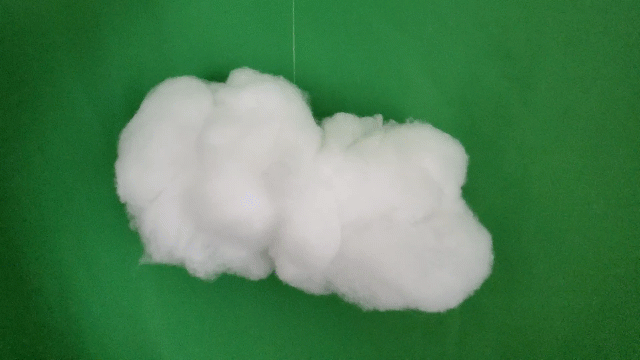
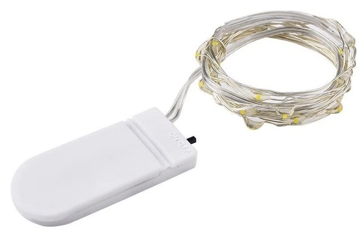
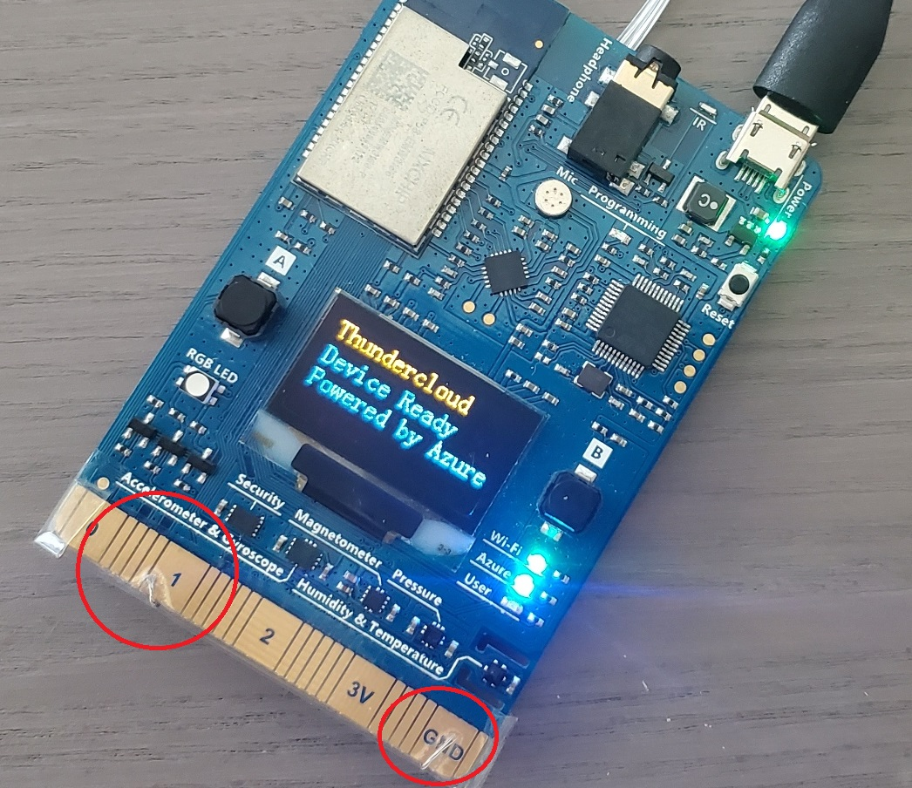
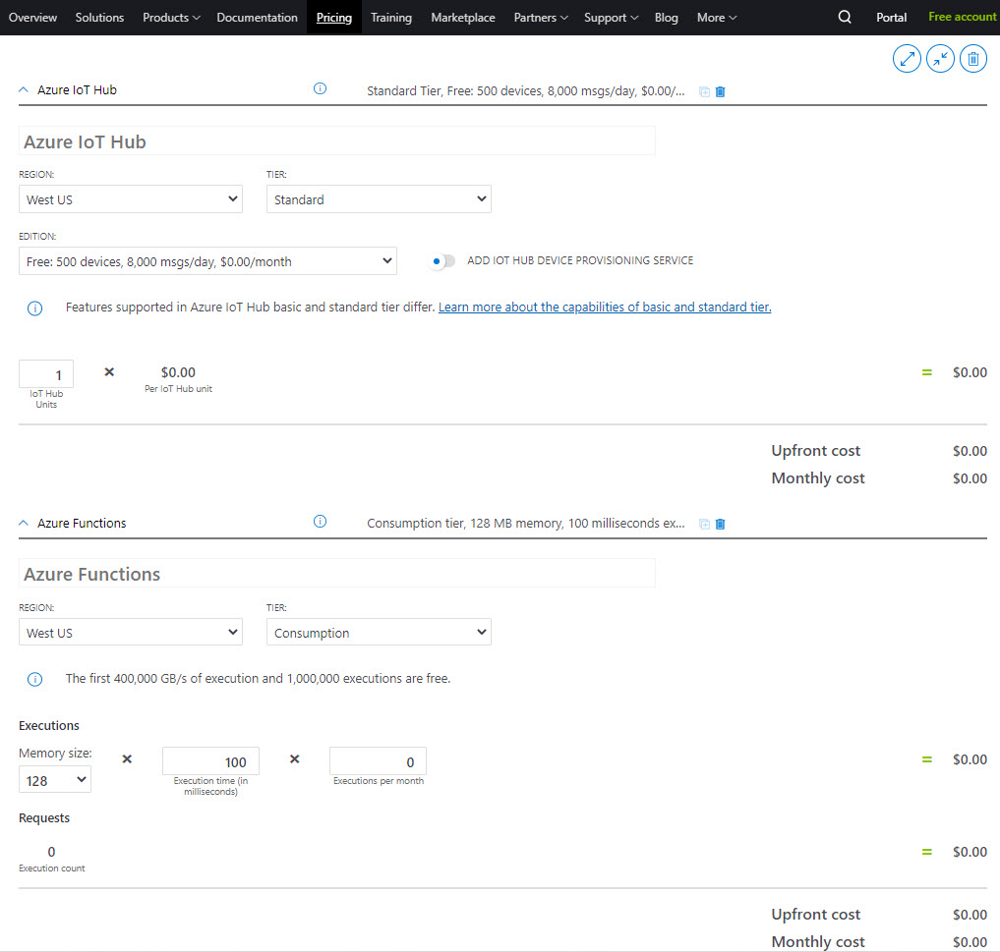

# Thundercloud

This project contains the software piece required to build a cloud of cotton with LED lights controlled remotely on the [MXChip Azure IoT Dev Kit](https://microsoft.github.io/azure-iot-developer-kit/v1/) by using [Azure IoT Hub](https://azure.microsoft.com/services/iot-hub) and an [Azure Function](https://azure.microsoft.com/en-us/services/functions).

Users send a message to the MXChip through the API hosted in the Azure Function and it will send the message to the Azure IoT Hub which pass the message to the device. Once the message is received in the device it will turn on the lights for 300 miliseconds.

The following diagram show the execution and interaction of the different components of the project.

> Note: The API can be called from a web browser, website, mobile app, bot, etc. In my case I added a button in my website to call the API. Check it out following this link: [https://davidsanchez.cr/projects](https://davidsanchez.cr/projects) 

## Hardware

Apart from the MXChip, this project required a set of [LED Lights](https://amzn.to/2MPPp9Q) and in addition you can get [decoration cotton](https://amzn.to/3dXrSzL) to wrap up the device and lights.

    

You can also buy the MXChip following this link [MXChip IoT Dev Kit](https://amzn.to/3cYpRSg).

### Setup

It's require to cut the wire cable of the LED Lights and stick the inside of the cables in the MXChip interface 1 and GND as shown in the image below:

 

Of course you can use a more professional approach and do the wiring in a different way like using a Kit for [micro:bit](https://amzn.to/2XX0g8b).

> Note: the MXChip is connected to a portable charger to avoid an extra wire in the cloud. 

## Software

In the source folder of this project you will find three sub folders with the following projects:

- **Deployment** (Azure Resource Manager) template that automates the deployment of the Azure services you will need to run the project. Including Azure IoT Hub, Azure Function with consumption plan on Linux. 

- **Device** Arduino project with the code required to receive the meesage from the IoT Hub and turn the LED Lights on. 
 
> Note: Before uploading the code to the device, it's required to configure the MXChip with IoT Hub following the steps in [this guide](https://docs.microsoft.com/en-us/azure/iot-hub/iot-hub-arduino-iot-devkit-az3166-get-started).

- **Function** C# HTTP Request Azure Function that connects with the Azure IoT Hub to send the message when an user call the API. This API doesn't require any parameter, just with a simple POST request. 

> Note: This Function requires to set a connection string for the IoT Hub, you can use [Azure Key Vault](https://azure.microsoft.com/services/key-vault).

## Azure Pricing

The Azure IoT Hub used in this project is using the free tier which allows up to 8000 messages per day and 500 devices per month for free. The Azure Function is under the consumption plan which include the first 1,000,000 executions per month for free.

> Note: for more details about pricing please visit the [Azure pricing calculator](https://azure.microsoft.com/pricing/calculator).

## Contributing

This project welcomes contributions and suggestions. If you face an error or have a question please open an issue. Also take a look at the issues that are open to check what features are in the backlog.